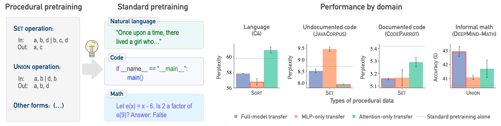

# Procedural Pretraining

<p align="center">
  
</p>

Official implementation for **"Procedural Pretraining: Warming Up Language Models with Abstract Data"**.

## Overview

Procedural pretraining is a lightweight pretraining stage where the language model is pretrained on procedurally-generated structured data. 
Intuitively, this 'warm-up' builds algorithmic scaffolding that ease the subsequent acquisition of world knowledge. 
We show that, by front-loading as little as 0.1% procedural data, procedural pretraining facilitates and enhances standard pretraining on diverse domains including natural language, code and mathematics.

## Repository Structure

```
procedural-pretraining/
├── procedural_pretraining/    # Pretraining on procedural data
│   ├── configs/               # Data configurations
│   └── README.md
├── procedural_data/           # Data generators for procedural tasks
├── downstream/
│   ├── algorithmic_tasks/     # Algorithmic reasoning
│   │   ├── configs/
│   │   └── README.md
│   └── semantic/              # Standard pretraining on semantic corpora
│       ├── configs/
│       ├── data/              # C4, CodeParrot, DeepMind-Math dataset classes
│       └── README.md
```

## Installation

```bash
pip install -r requirements.txt
```

## Quick Start

### 1. Procedural Pretraining

Train a model on a procedural task:

```bash
python -m procedural_pretraining.cli --config procedural_pretraining/configs/set.yaml
```
### 2. Use a procedurally-pretrained model for standard pretraining or algorithmic reasoning tasks.

Standard pretraining: on natural language (C4), code (CodeParrot), and mathematics (DeepMind-Math).

```bash
# C4 language modeling
python downstream/semantic/c4.py \
    --config downstream/semantic/configs/c4.yaml \
    --pretrained_path pretrained_models/procedural/set/checkpoint-2500
```

Algorithmic reasoning tasks: needle in a haystack, (reversed) addition, multiplication, etc.

```bash
python downstream/algorithmic_tasks/experiment_stream.py \
    downstream/algorithmic_tasks/configs/procedural.yaml \
    --pretrained_model_path=pretrained_models/procedural/set/checkpoint-2500
```

## Documentation

- [Procedural pretraining](procedural_pretraining/README.md)
- [Standard semantic pretraining](downstream/semantic/README.md)
- [Algorithmic reasoning Tasks](downstream/algorithmic_tasks/README.md)

## Citation

If you find this work useful, please cite our paper:

```bibtex
@article{jiang2025proceduralpretraining,
  title={Procedural Pretraining: Warming Up Language Models with Abstract Data},
  author={Jiang, Liangze and Shinnick, Zachary and van den Hengel, Anton and Saratchandran, Hemanth and Teney, Damien},
  year={2026},
}

```